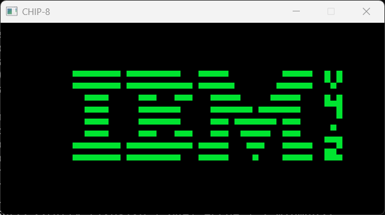

# CHIP-8 emulator in Jai



## Quick Start

Jai version:

```
$ jai -version
Version: beta 0.2.025, built on 19 January 2026.
```

To build:

```
$ jai -import_dir ./libs main.jai
```

To run:

```
$ main <rom>
```

## Notes

- Passes all tests from [Timendus's CHIP-8 test suite](https://github.com/Timendus/chip8-test-suite).
- Does not support SUPER-CHIP or XO-CHIP instructions.

## References

- [Timendus's CHIP-8 test suite](https://github.com/Timendus/chip8-test-suite)
- [CHIP-8 Wikipedia article](https://en.wikipedia.org/wiki/CHIP-8)
- [Tobias's Guide to making a CHIP-8 emulator](https://tobiasvl.github.io/blog/write-a-chip-8-emulator/)
- [Cowgod's CHIP-8 Technical Reference](http://devernay.free.fr/hacks/chip8/C8TECH10.HTM)
- [Jocabin's CHIP-8 emulator in Odin](https://github.com/Jocabin/chip-8-emulator)
